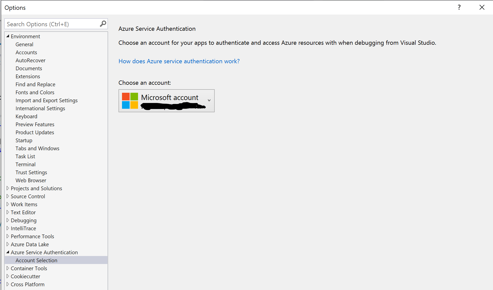

# Reactive handling of secret key rotation in .Net Core Applications using Polly.
Secret key rotation is a common process in production applications where organizations do a periodic or sometimes adhoc key rotation of their azure services like cosmos db, storage accounts, event hubs etc. for the security reasons.

When the new rotated keys are updated to KeyVault, the consuming apps start failing as the secrets used are not valid anymore, so either we must restart our apps or programmers implement long polling to KeyVault to do a periodic secret refresh. Both approaches are not efficient as the first one requires manual intervention or some sort of custom app that can trigger an app restart when keys get rotated and in the second one if you poll too frequently then it will add to unnecessary KeyVault cost and if you do it with a longer duration then your app can have a downtime.

This code sample addresses this problem, i have considered Cosmos and Storage account services as exmples but you can extend it for other services as well.

## Pre-Requisites
You need to have following azure resources

* Storage Account
* Cosmos DB
* Key Vault

### Add the following secrets with corresponding values to your KeyVault:
* CosmosUrl        (Value should be your cosmos account URI)
* CosmosKey        (Value should be your cosmos account primary key)
* CosmosDatabase   (Value should be name of your cosmos database)
* CosmosCollection (Value should be name of your cosmos db collection)
* BlobConnection   (Value should be your storage account connection string, not just the key.)

Note: Some sample data is expected in cosmos collection, query used in the CosmosDBService expects a property called "title" in your documents e.g:
```json
{
  "id":"12345",
  "title":"sample book 1"
}
```

If you want to run it on your existing data then change the query accordingly in /DataAccess/CosmosDbService.cs class at line #19
```
string sqlQuery = "select value c.title from c";
```
Also you need to have container with some sample files in it.

### Running sample code
1. Open the KeyRotationSample.sln file in visual studio
2. In appsettings.json file provide the name of your KeyVault

```
Replace <YOUR-KEYVAULT-NAME> with your key vault name.
KeyVaultUrl": "https://<YOUR-KEYVAULT-NAME>.vault.azure.net/
```

3. Configure [Azure service authentication](https://docs.microsoft.com/en-us/azure/key-vault/general/service-to-service-authentication#:~:text=Authenticating%20with%20Visual%20Studio,local%20development%2C%20and%20select%20OK.) in Visual Studio.



4. Run the solution.

There are two endpoints in the sample controller:

```
http://localhost:5000/api/KeyRotationSample
```
This returns data from cosmos db collection

```
http://localhost:5000/api/KeyRotationSample/blobs/{containername}
```
This provides list of blob files in the given controller.

5. Hit those end points to validate data is retrieved.

6. Leave the app running and go ahead to rotate the cosmos and storage keys.

7. Update CosmosKey and BlobConnection secret values in KeyVault with new values.

8. Hit the end points again and this time Polly retry policies will refresh the cosmos and storage services with new secret values and your app will continue to work without any down time and without any manual interruption.

## How it works?
It uses Polly retry mechanism to refresh the azure service clients with new keys from KeyVault and retries the operation again after failure. Every cosmos or blob storage operation is wrapped inside polly retry policy like:

```
var result = await keyRotation.RetryCosmosPolicy.ExecuteAsync(() => cosmosDbService.GetSampleDataAsync()).ConfigureAwait(false);

var result = await keyRotation.RetryBlobPolicy.ExecuteAsync(() => blobService.ListBlobs(containerName)).ConfigureAwait(false);
```

`cosmosDbService` and `blobService` will use the respective clients which were created on app startup to execute respective operations. When you rotate keys and push new secrets to KeyVault these operations will start failing, since these are wrapped inside the retry policies which upon failure will watch out for specific type of exceptions and status codes and on matching conditions retry policies will make sure to refresh the service clients and try the operation again. 

Cosmos Retry Policy
```
private AsyncRetryPolicy GetCosmosRetryPolicy()
        {
            return Policy.Handle<CosmosException>(e => e.StatusCode == HttpStatusCode.Unauthorized)
                .RetryAsync(1, async (exception, retryCount) =>
                {
                    try
                    {
                        await semaphoreSlim.WaitAsync().ConfigureAwait(false);
                        logger.LogInformation("Read the cosmos key from KeyVault.");

                        // Get the latest cosmos key.
                        var cosmosKeySecret = await keyVaultClient.GetSecretAsync(configuration["KeyVaultUrl"], Constants.CosmosKey).ConfigureAwait(false);

                        logger.LogInformation("Refresh cosmos connection with upadated secret.");
                        cosmosDbService.Reconnect(new Uri(configuration[Constants.CosmosUrl]), cosmosKeySecret.Value, configuration[Constants.CosmosDatabase], configuration[Constants.CosmosCollection]);
                    }
                    finally
                    {
                        // release the semaphore
                        semaphoreSlim.Release();
                    }
                });
        }
```

Blobservice Retry Policy

```
private AsyncRetryPolicy GetBlobRetryPolicy()
        {
            return Policy.Handle<RequestFailedException>(e => (e.Status == (int)HttpStatusCode.Unauthorized || e.Status== (int)HttpStatusCode.Forbidden))
                .RetryAsync(1, async (exception, retryCount) =>
                {
                    try
                    {
                        await semaphoreSlim.WaitAsync().ConfigureAwait(false);
                        logger.LogInformation("Read the blob connection from KeyVault.");

                        // Get the latest blob connection key.
                        var blobConnectionSecret = await keyVaultClient.GetSecretAsync(configuration["KeyVaultUrl"], Constants.BlobConnection).ConfigureAwait(false);


                        logger.LogInformation("Refresh blob storage connection with upadated secret.");
                        blobStorageService.RefreshBlobServiceClient(blobConnectionSecret.Value);
                    }
                    finally
                    {
                        // release the semaphore
                        semaphoreSlim.Release();
                    }
                });
        }
```

So this is how you can reactively handle your rotated secrets in your .net core apps without restarting your application and without continuously polling your KeyVault for updated secrets.


